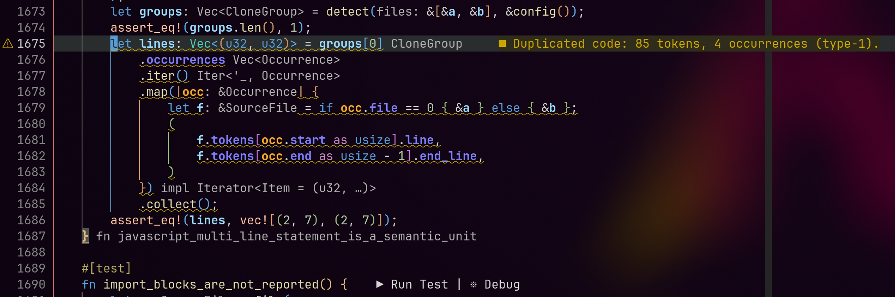

# dup-detector

[English](README.md) | 简体中文

一个在代码库中查找**重复代码**的工具，提供 LSP、MCP 与 CLI，目标是与 JetBrains IDE 的 _Duplicated Code_ 检查对齐。

与基于文本/正则的方案不同，`dup-detector` 基于 **tree-sitter 生成的 token 流**，并使用**参数化（重命名不变）编码**，因此即使变量或字面量被重命名，只要结构相同也能识别出来。



## 重复类型

| 类型   | 含义                                     | 支持情况         |
| ------ | ---------------------------------------- | ---------------- |
| Type-1 | 除空白/注释/格式外完全相同               | 支持             |
| Type-2 | 标识符（以及可选的字面量）被一致地重命名 | 支持（核心目标） |

## 主要特性

- **语义级而非文本级** —— 注释、空白和格式完全不影响结果。
- **重命名不变** —— `a = b + c` 与 `x = y + z` 视为同一克隆。
- **多语言** —— Rust、Python、JavaScript、TypeScript/TSX、C++。
- **高性能** —— 并行解析、遵循 `.gitignore` 的文件发现、种子哈希、基于 mtime 增量刷新的内存索引，以及跨进程复用的磁盘 token 缓存。
- **三种使用方式** —— 面向编码代理的常驻 MCP 服务器、面向编辑器的 LSP 服务器，以及 `scan` 命令行。

## 支持的语言

Rust、Python、JavaScript、TypeScript、TSX、C++（`.rs`、`.py`/`.pyi`、`.js`/`.mjs`/`.cjs`/`.jsx`、`.ts`/`.mts`/`.cts`、`.tsx`、`.cpp`/`.cc`/`.cxx`/`.c++`/`.hpp`/`.hh`/`.hxx`/`.h++`/`.h`/`.ipp`/`.inl`/`.tpp`）。

## 下载

从 [GitHub Releases](https://github.com/crlcrl1/dup-detector/releases) 下载适合平台的压缩包，解压后将 `dup-detector`（Windows 下为 `dup-detector.exe`）放入 `PATH` 包含的目录。

| 平台 | 架构 | Release 附件 |
| --- | --- | --- |
| Linux（GNU，在 Ubuntu 22.04 上构建） | x86_64 | `dup-detector-x86_64-unknown-linux-gnu.tar.gz` |
| Linux（GNU，在 Ubuntu 22.04 上构建） | ARM64 | `dup-detector-aarch64-unknown-linux-gnu.tar.gz` |
| macOS | Intel | `dup-detector-x86_64-apple-darwin.tar.gz` |
| macOS | Apple Silicon | `dup-detector-aarch64-apple-darwin.tar.gz` |
| Windows | x86_64 | `dup-detector-x86_64-pc-windows-msvc.zip` |
| Windows | ARM64 | `dup-detector-aarch64-pc-windows-msvc.zip` |

每个压缩包包含二进制、许可证和中英文 README。`SHA256SUMS` 列出所有压缩包的 SHA-256 校验值。在 Linux 上，将该文件和下载的压缩包放在同一目录，执行 `sha256sum --check --ignore-missing SHA256SUMS` 即可校验。

发布正式版或预发布版 Release 时，[发布工作流](.github/workflows/release.yml) 会使用 Rust 1.98.1 和 `Cargo.lock`，为六个平台编译该标签对应的源码，检查各二进制能否启动并扫描示例，待全部构建成功后上传压缩包和校验文件。发布标签中需要包含该工作流。仅创建草稿或推送标签不会触发构建，需要发布 Release。

若要重新构建已有 Release，在 **Actions → Release binaries → Run workflow** 中填写 `tag`。手动运行入口要求默认分支中已有该工作流；运行时会检出填写的标签，并覆盖 Release 中的同名附件。上传使用 GitHub 内置的 `GITHUB_TOKEN`，无需额外配置 secret。

## 从源码构建

需要 Rust 1.98+（edition 2024）。

```bash
cargo build --release
# 产物：target/release/dup-detector
```

## 快速开始

```bash
# 通过 stdio 启动 MCP 服务器
dup-detector mcp

# 通过 stdio 启动语言服务器
dup-detector lsp

# 扫描某个路径（默认当前目录）
dup-detector scan <path>

# JSON 输出并调整阈值
dup-detector scan <path> --json --min-lines 7 --max-groups 50
```

## 文档

- [配置文件与 CLI](docs/zh-CN/configuration.md) · [English](docs/configuration.md)
- [MCP 服务器](docs/zh-CN/mcp.md) · [English](docs/mcp.md)
- [编辑器集成（LSP）](docs/zh-CN/lsp.md) · [English](docs/lsp.md)
- [架构与实现](docs/zh-CN/architecture.md) · [English](docs/architecture.md)

`AGENTS.md` 详细记录了架构、算法与编码规范。

## 许可证

基于 [Apache License 2.0](LICENSE) 授权。
